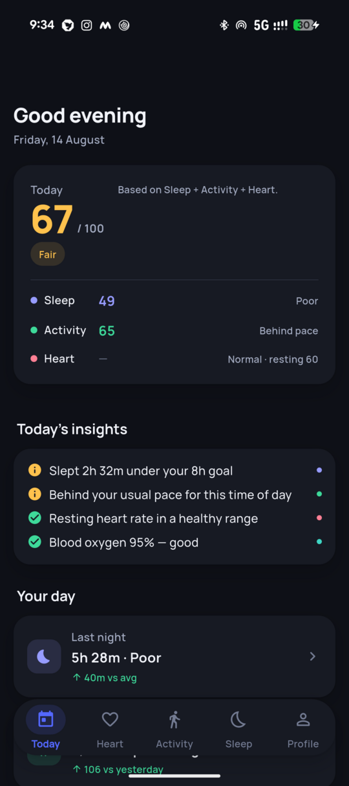
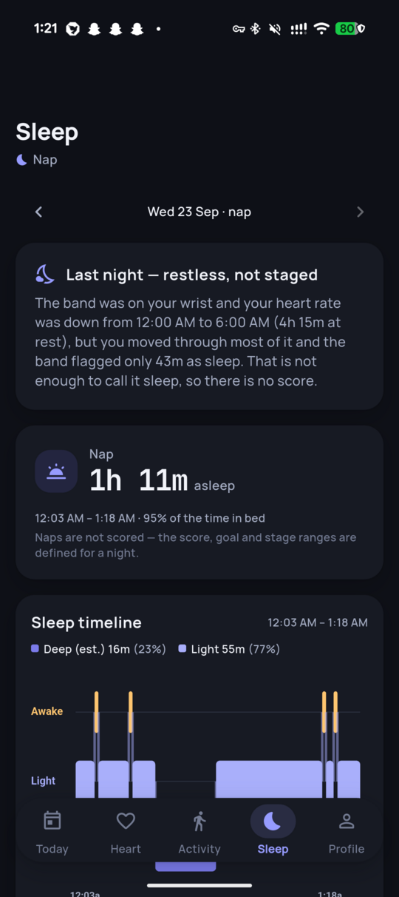
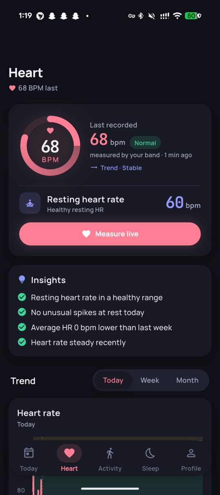
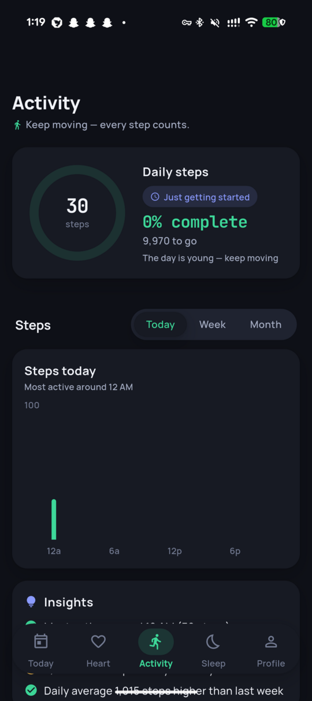
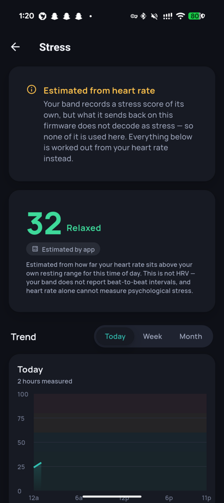

# Mi Band 6 — open Flutter companion app

[](LICENSE)
[](https://flutter.dev)
[](#requirements)
[](test/)

An independent Android companion for the **Xiaomi Mi Band 6**, built on a
reverse-engineered protocol. No Xiaomi account, no cloud sync, no telemetry —
your data stays on your phone.

The protocol was reconstructed from the **Gadgetbridge** source, cross-checked
against the decompiled **Notify** (`com.mc.miband1`) and **Mi Fit** APKs, then
confirmed against the physical band. The authoritative spec lives in
[`docs/reverse-engineering/protocol-mb6.md`](docs/reverse-engineering/protocol-mb6.md),
where every byte cites its source.

---

## The rule this project is built on

**A health app that invents numbers is worse than one that shows fewer.**

That is not a slogan; it is enforced. When the band's own stress stream turned
out to decode as ordinary activity bytes, the feature was switched off and the
screen now says so in plain words, rather than continuing to show a confident
red "96 — High" built from a heart-rate byte
([findings-23](docs/reverse-engineering/findings-23.md)).

The same thing happened to deep sleep, twice. The first detector could be tuned
anywhere from 5% to 19% — inside the published healthy range — but the minutes
it picked were spread evenly across the night, and real slow-wave sleep is
front-loaded; it was withdrawn rather than calibrated
([findings-24](docs/reverse-engineering/findings-24.md)). It came back only
with a rule whose front-loading is a property of the model, checked on 56 real
nights, and it is labelled an estimate on every surface that shows it
([findings-25](docs/reverse-engineering/findings-25.md)). A night the band
cannot classify is reported as what was measured — hours at rest, movement
throughout — not as sleep ([findings-26](docs/reverse-engineering/findings-26.md)).

Every metric is either measured, derived-and-labelled, or **absent**. Anything
not yet confirmed on real hardware is listed as unconfirmed in
[`pending-hardware-verification.md`](docs/reverse-engineering/pending-hardware-verification.md).

---

## Screenshots

Real data from a real band, dark mode. Every number is a monospace figure,
metrics are ledger rows rather than tiles, and each group carries an evidence
line saying where its numbers came from.

| Today | Sleep | Heart |
|---|---|---|
|  |  |  |

| Activity | Stress |
|---|---|
|  |  |

---

## Features

| Feature | Status |
|---|---|
| Sign-key (ECDH) authentication | ✅ hardware-verified |
| Realtime heart rate + history | ✅ hardware-verified |
| Steps / distance / calories | ✅ hardware-verified |
| Battery | ✅ hardware-verified |
| SpO2 history | ⚠️ parser hardware-verified; only shown when actually measured that night |
| Sleep sessions, duration, efficiency | ✅ validated on 56 real nights; sessions anchor on the band's flag *or* corroborated stillness ([findings-26](docs/reverse-engineering/findings-26.md)) |
| Deep sleep | ⚠️ **estimated** — two-process model, front-loaded by construction, labelled "est." everywhere ([findings-25](docs/reverse-engineering/findings-25.md)) |
| Incoming calls on the band | ✅ once per ringing call, from telephony state — never from the dialer's notification ([§12.4](docs/reverse-engineering/protocol-mb6.md)) |
| Band buttons → phone (decline, silence, find my phone) | ✅ hardware-subscribed post-auth; needs phone permissions; Silence needs Do Not Disturb access ([§12.1](docs/reverse-engineering/protocol-mb6.md)) |
| Decline with a text | ✅ phone-side; sends when the call notification carried a number |
| Automatic SpO2 (band samples on its own) | ⚠️ **experimental, off by default** — a config bit the band may ignore ([P14.2](docs/reverse-engineering/pending-hardware-verification.md)); no phone-triggered measurement exists on this firmware path |
| Quick replies on the band | ⚠️ **experimental, off by default** — the receive path is disabled upstream as unsafe ([P13.1](docs/reverse-engineering/pending-hardware-verification.md)) |
| Multi-round history sync (survives gaps in the band's buffer) | ✅ hardware-verified |
| Band settings (HR interval, display, goals, DND…) | ✅ every command accepted on device |
| Background connection + auto-reconnect | ✅ backoff observed live |
| Light + dark theme | ✅ device-verified ([findings-22](docs/reverse-engineering/findings-22.md)) |
| Overnight snoring detection (phone mic, on-device) | ✅ hardware-verified |
| Stress — history + trend | ⚠️ estimated from heart rate, labelled as such |
| Stress — the band's own measurement | ❌ **quarantined** — what the band returns does not decode as stress ([P9.1](docs/reverse-engineering/pending-hardware-verification.md)) |
| Notifications → band | ⚠️ rewritten end-to-end, post-swipe delivery unverified ([P5.2](docs/reverse-engineering/pending-hardware-verification.md)) |
| HRV / recovery | ❌ **not possible** — this firmware sends no RR intervals |

### What this app deliberately does **not** show

Omitted on purpose, each with a reason:

- **REM sleep** — the firmware never populates the REM byte.
- **HRV / recovery** — needs beat-to-beat intervals; all 34 captured heart-rate
  notifications are 2 bytes with the RR flag clear.
- **Floors climbed** — no altimeter on this band.
- **Hydration** — no sensor; it would be a manual log pretending to be a metric.
- **SpO2 all-day / sleep-breathing quality toggles** — ZeppOS-only settings this
  band's protocol has no equivalent for. Absent, not greyed out: a disabled
  switch implies "nearly there".

---

## Setup

### Requirements

- **Flutter 3.44+**
- **Android device**, API 21+ (the background service targets 13+)
- **A JDK with a compiler.** If Gradle reports
  `Toolchain installation … does not provide the required capabilities: [JAVA_COMPILER]`,
  your default `java` is a JRE, not a JDK. The error message is misleading —
  it usually surfaces as a cache/metadata error first. Fix:
  ```bash
  export JAVA_HOME=/opt/android-studio/jbr   # or any real JDK
  ```
- A **Mi Band 6**, and its 16-byte auth key (see below)

### Build and run

```bash
git clone https://github.com/KiranPranay/miband6-oss.git
cd miband6-oss
flutter pub get
flutter analyze          # expected: No issues found!
flutter test             # expected: all green
flutter run              # or: flutter build apk --release
```

### Pairing

1. **Unpair the band from Zepp Life / Mi Fit first.** A Mi Band talks to one
   host at a time; leaving it paired elsewhere will fight this app for the
   connection.
2. Enter your auth key: **Profile → Settings → Authentication → Auth Key**.
3. **Profile → Settings → Device → Scan & Connect**, and pick the band.

It then reconnects on its own — including after a reboot — until you explicitly
disconnect.

### Getting the auth key

The band only authenticates with the key it was paired with. Common routes:

- **From Zepp Life on Android** — pair in Zepp Life, then read the key from the
  app's local database (`origin_db`, `devicelist` table) with root or an ADB
  backup, or use a community key-extractor tool.
- **From a Xiaomi/Zepp account export** — the token appears in the device record
  the account API returns at pairing time.

Enter it as 32 hexadecimal characters. It is stored via `flutter_secure_storage`
(Android Keystore) and never leaves the device.

### Permissions, and why each is needed

| Permission | Why |
|---|---|
| `BLUETOOTH_SCAN` / `BLUETOOTH_CONNECT` | find and talk to the band |
| `ACCESS_FINE_LOCATION` | Android requires it for BLE scanning |
| `FOREGROUND_SERVICE` + `…_CONNECTED_DEVICE` | keep the BLE link alive with the screen off |
| `POST_NOTIFICATIONS` | the persistent connection notification (Android 13+) |
| `REQUEST_IGNORE_BATTERY_OPTIMIZATIONS` | asked **once, with an explanation**. Doze otherwise suspends the link overnight — exactly when sleep tracking runs. Declining is fine; the app degrades to foreground-only |
| `RECEIVE_BOOT_COMPLETED` | reconnect after a reboot without opening the app |
| Notification access (special) | read notifications to forward them to the band |
| `RECORD_AUDIO` + `…_MICROPHONE` | **opt-in only**, for overnight snoring detection. Audio is analysed in memory, never written to disk or transmitted |

---

## Privacy

- Everything is stored on the device, in the app's private directory.
- **No network permission is used for your health data.** There is no account,
  no sync, no analytics, no crash reporting.
- **Android Auto Backup is switched off** (`allowBackup=false`, plus explicit
  cloud-backup and device-transfer exclusions). Without that, the app's private
  directory — months of per-minute data, and the keystore blob holding your
  band's auth key — is eligible for upload to your Google account. The history
  can be re-fetched from the band, so there is nothing worth backing up.
- The auth key lives in the Android Keystore.
- Snoring detection is opt-in and analyses microphone audio **in memory only**;
  no recording is ever saved or sent.
- Notification forwarding reads notification content to relay it to the band.
  A **Private alerts** switch sends only the app name and title, never the
  message text.

Uninstalling removes all of it. See [SECURITY.md](SECURITY.md) to report a
vulnerability.

---

## Validating the analysis yourself

The analysis engines are pure Dart and run outside the app, so you can point
them at a real capture and check the output against published norms:

```bash
# Pull a capture off the phone (debug build, run-as needs a debuggable app)
adb shell "run-as com.example.band cat app_flutter/activity_data.json" > activity.json
adb shell "run-as com.example.band cat app_flutter/hr_data.json"       > hr.json

dart run tool/analyze_capture.dart activity.json hr.json
```

It prints every detected night with its staging, then checks the results
against the literature — deep-sleep share, efficiency, session length, the
Sleep Regularity Index — and tells you which checks **fail**. That harness is
how the sleep defects in
[findings-21](docs/reverse-engineering/findings-21.md) and
[findings-23](docs/reverse-engineering/findings-23.md) were found; unit tests
prove internal consistency, but only real data shows whether a night is
physiologically plausible.

---

## Project layout

```
lib/core/                    protocol + analysis engines (pure, unit-tested)
  ble_manager.dart             connection, auth, characteristics, sync
    ├── huami2021_auth.dart        sign-key (ECDH) handshake
    ├── connection_supervisor.dart backoff, adapter state, liveness
    └── hardware_test_session.dart gated on-device test runner
  activity_fetcher.dart        activity / SpO2 / stress fetch + parsers
  sleep_analyzer.dart          session detection + staging
  sleep_analysis.dart          scoring, insights, baselines
  stress_analyzer.dart         stress history + HRV maths (unfed) + fallback
  heart_analysis.dart          resting HR, zones, trends
  activity_analysis.dart       steps, pace, sedentary analysis
  band_config.dart             every band setting, as bytes
  alert_manager.dart           notification wire format
lib/storage/activity_store.dart  persistence, de-duplication, watermarks
lib/ui/                      screens, tabs, design tokens
android/…/kotlin/            notification listener + warm FlutterEngine
tool/analyze_capture.dart    offline validation harness
docs/reverse-engineering/    protocol spec, findings, verification ledger
```

## Documentation

| Document | What it is |
|---|---|
| [`00-INDEX.md`](docs/reverse-engineering/00-INDEX.md) | Status and the whole iteration log |
| [`protocol-mb6.md`](docs/reverse-engineering/protocol-mb6.md) | **Authoritative** spec — every byte cites a source |
| [`pending-hardware-verification.md`](docs/reverse-engineering/pending-hardware-verification.md) | What is **not** verified, and the probe that would settle each |
| [`findings-NN.md`](docs/reverse-engineering/) | One investigation each, with the evidence |
| [`diff-our-vs-correct.md`](docs/reverse-engineering/diff-our-vs-correct.md) | Living "we did X, correct is Y" table |
| [`hardware-test-session.md`](docs/reverse-engineering/hardware-test-session.md) | The gated on-device runner (gates 0→6) |
| [`ui-ux-review.md`](docs/ui-ux-review.md) | Design decisions and open items |
| [`sleep-score.md`](docs/sleep-score.md), [`health-score.md`](docs/health-score.md), … | How each score is composed, and why |

---

## Contributing

Contributions welcome — please read [CONTRIBUTING.md](CONTRIBUTING.md) first.
Two rules matter more than style:

1. **Every byte written to the band needs a cited source** — a Gadgetbridge
   class:line or a decompiled reference — recorded in `protocol-mb6.md`
   *before* the first hardware write.
2. **Never claim a measurement you cannot make.** If the data is not there, omit
   the metric and say why.

When the docs and the hardware disagree, **the hardware wins** — add a probe to
the verification ledger rather than guessing.

---

## Licence

**GNU Affero General Public License v3.0 or later** — see [LICENSE](LICENSE).

This is not a free choice. `lib/core/ecdh_b163.dart` and
`lib/core/huami2021_chunked.dart` are direct Dart translations of
[Gadgetbridge](https://codeberg.org/Freeyourgadget/Gadgetbridge) source
(© Andreas Shimokawa and contributors, AGPL-3.0-or-later), which makes them
derivative works. [NOTICE.md](NOTICE.md) records every attribution, including
the published research the health analysis is based on.

In short: you may use, study, modify and redistribute this, but derivatives must
stay AGPL and ship their source.

Not affiliated with, endorsed by, or connected to Xiaomi, Huami/Zepp Health, or
the Gadgetbridge project. *Xiaomi*, *Mi Band*, *Mi Fit* and *Zepp* are
trademarks of their respective owners.

> **Not a medical device.** Nothing here is a diagnosis, and none of it should
> be used to make a medical decision. It is a consumer fitness band and an app
> that reads it.
